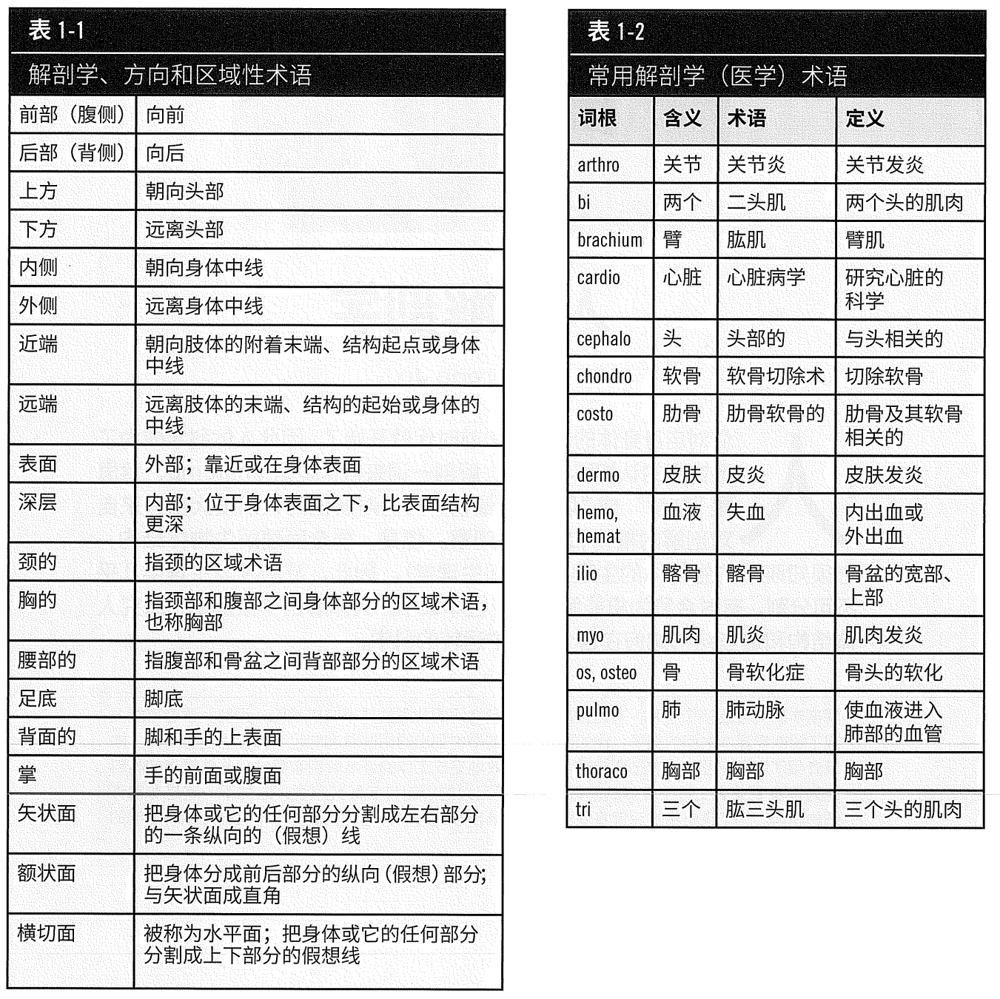

# ACE-CPT

# 人体解剖学

PS：可以搜索：PS 来看自己的备注，后面还需要进行更贴切的类比。

## 解剖学方向部位和姿势

## 人体的层次

细胞 -> 组织 -> 器官 -> 系统

健身专业人士应该对肌肉、神经和结缔组织的结构和功能有基本的了解，应该熟悉以下系统：心血管系统、呼吸系统、消化系统、骨骼系统、神经系统、肌肉系统和内分泌系统。

### 心血管系统

心血管系统或循环系统是闭路系统，由心脏、血管和血液组成。**血液通过心脏不断地沿着圆形路线流到动脉，然后到毛细血管，再到静脉，最后返回心脏。**

与呼吸系统一起，心脏和血管组织给身体输送营养物质，同时带走废物，例如二氧化碳和代谢副产物。

#### 血液

**血液**是心血管系统的流体成分，通过在身体的内部环境和外部环境之间以及各细胞和组织之间传输物质，实现两个环境的连接。

**血浆**是血液的流体部分，负责向整个身体输送激素、血浆蛋白、食物原料（如碳水化合物、氨基酸和脂肪）、离子（例如纳、氯离子、碳酸氢盐）和气体（如氧气、氮气和二氧化碳）。

血液中不是血浆的部分包含红细胞、各种类型的白细胞和血小板。

血液的主要功能就是输送，还有温度调节和酸碱平衡的作用。

#### 血管

血液通过血管输送到全身，血管主要包括：

- 大动脉和小动脉，负责将富氧血从心脏带走
- 大静脉和小静脉，负责将缺氧血输送回心脏
- 毛细血管，为血液和组织之间的气体、营养物质和废物交换提供场地

**PS：可以理解成大动脉是财务部负责把资金（养分）带来，然后毛细血管是每个部门将资金消耗完，接着再给财务部提资金需求，心脏就是融资部门。**

**PS：一个小思考：是先有动脉的那些毛细血管，还是动脉血造就了动脉？**

血液离开心脏滋养全身，主要通过主动脉输送，大动脉及其主分支较厚而有弹性，在从心脏喷出血液时被动拉伸。

**动脉硬化**（即由于斑块积聚导致动脉硬化和动脉狭窄），易发病人群通常是老年人，此病会导致动脉硬度增加，动脉扩张能力下降。此状况会使得血压升高，这通常与年龄增大有关。

**血液离开心脏，进入动脉**，动脉在行径中广泛分支形成一棵棵“小树”，而形成的微血管叫做小动脉。最终小动脉发展成更小的结构，毛细血管的“床”。

**毛细血管**壁极薄，使血液和细胞之间存在的间质液之间可以交换物质。

血液通过毛细血管床到达更小的静脉管道——**小静脉**。随着血液从小静脉回流到心脏，他们的大小增加并成为静脉。相比动脉壁，静脉壁更薄，弹性也较小。

在下肢静脉内常可见**瓣膜**，它能使血液仅按一个方向朝**心脏**流动。

血液离开主静脉->上、下腔静脉->直接进入心脏，心脏继而将血液输送到**肺部**汲取新鲜的氧气。

#### 心脏

心脏就像是一个泵，在全身内推动血液流动。心脏位于两肺之间，居正中间左侧，胸骨后面。成年人的心脏大小基本上跟自己握起来的拳头相当。

心脏分为2个心房和2个心室，心房较大位于心室的上方：

- **左心房和左心室负责体循环**
- **右心房和右心室负责肺循环**

心脏的左右两部分被肌肉壁——**室间隔** 隔开，它的作用是阻止心脏两侧的血液混流。

要像一个泵一样运作，心脏必须同时具备**接受血液和推送血液的心室以及瓣膜**，心脏内的血液从心房（接受室）流动到心室（推送室）。再从心室流动到动脉。单向瓣膜可阻止心脏内的血液回流。

**左/右房室瓣膜**分别将左/右心房和心室连接起来。**肺动脉半月瓣膜**（右心室）和**大动脉半月瓣膜**（左心室）可组织血液从动脉回流到心室。

**肺循环**：心脏右侧接受消耗部分氧气的血液，在血液流过细胞后，血液中的二氧化碳浓度将升高。然后将血液推送到肺部，在这里，血液释放二氧化碳，吸收氧气。心脏左侧从肺部接收含新鲜氧气的血液并通过**体循环**将其泵送到全身组织。

**PS：心脏右侧收到经费申请（静脉）开始对外融资，接着把资金给到心脏左侧，让其推送给财务部（动脉）。**

**血液流经心脏的具体路径**：从作为静脉血开始（血液通过静脉流回心脏）。静脉系统的所有血液都会首先进入右心房。血液从右心房进入右心室，在通过肺动脉（输送富氧血的动脉除外）被泵送到肺部。在肺部，血液吸收新鲜的氧气并释放二氧化碳。含氧血通过肺静脉（输送缺氧血的肺静脉除外）从肺部回流到左心房。血液从左心房进入左心室，然后通过主动脉被泵送到身体的其他部位（肺部除外）。

**心动周期**是从一次心跳开始到下一次心跳开始的时间段。心脏右侧和左侧同时执行泵操作。换句话就是说就是，当心脏跳动时，两个心房同时收缩，将血液分别泵送到两个心室。

心房收缩大约0.1秒时，两个心室也会收缩以将血液输送到肺循环和体循环。收缩和舒张的重复阶段叫做**收缩期**和**舒张期**：

- 收缩期指心动周期的收缩阶段，在此期间，血液离开心室
- 舒张期指心动周期的舒张阶段，在此期间，血液流到心室

PS：心房带动心室，心室收缩后就挤压出富氧血进入动脉，心室舒张压强小静脉血就流入了

### 呼吸系统

呼吸系统的结构提供一种替换氧气和从血液中带走二氧化碳的方式，从而使得身体可以在外部环境和组织之间交换气体，并对发声和酸碱平衡起到重要作用。

呼吸系统由鼻、鼻腔、咽、喉、气管、支气管和肺构成。这些结构一起形成了一组过滤气体并将其输送到肺部的气道，在这个气道里，气体在微气囊——**肺泡**中进行交换。

#### 气体的流向

PS：鼻孔/口 -> 气管 -> 左/右原发性支气管 -> 二级支气管 -> 三季支气管 ->细支气管 -> 末端细支气管 -> 呼吸性细支气管 -> 肺泡

气体通过鼻孔和口进入呼吸系统。吸入的空气被加热，再经过**咽**（咽喉）进入**喉**（喉结部位）。

人类在休息时，通常每分钟要通过鼻子呼吸**5到6升**气体，但是在锻炼期间，对于换气时用嘴呼吸的情况，每分钟要呼吸的气体会增加到大约20到30升。

气体从喉经过的**支气管**（气管），而支气管延伸到第五或第六胸椎，在此分为两个小分支：右主支气管和左主支气管（**原发性支气管**）。

主支气管分为较小的二级支气管，而每一个肺叶都有一个小支气管。二级支气管进一步分支，分为许多**三级支气管**，形成小的**细支气管**。

细支气管继续分支，形成**末端细支气管**，最终分为更小的**呼吸性支气管**（末端为肺泡集群，即薄壁气囊）。

#### 肺和呼吸肌

肺大约有**3亿个**肺泡，为气体交换提供了巨大的表面积。据估计，人类肺部可展开的表面积相当于一个网球场大小。

两个肺被包裹在胸腔内。这些成对的锥形结构布满了一级、二级、三级支气管以及各种细支气管和肺泡。

两肺由**纵隔膜**分隔，其覆盖了心脏、主动脉、食管等几个重要气管和部分气管。

两肺位于**横膈膜**上，这是吸气的重要肌肉，也是唯一一块**被认为是生命必须的骨骼肌**。

横膈膜收缩时，将腹部组织向下推和向上推，而**肋间外肌**（在肋骨之间运行的肌肉群）向外提起肋骨，包裹肺的细胞膜的压力会，反过来会使肺扩张，此扩张可以让气流进入肺部。休息时，横膈膜和肋间外肌负责大部分的吸气工作。但是在身体活动期间，会运用到**吸气辅助肌**，包括胸小肌、斜角肌和胸锁乳突肌。通过横膈膜和肋间外肌进一步增加胸腔的容积，这些肌肉可以**辅助吸气**。

在正常平静时，呼气是被动的，不需要肌肉动作的辅助。**但是在锻炼期间，呼气将变为主动的**。激活呼气的重要肌肉，例如腹直肌、内斜肌、后锯肌和肋间内肌，以帮助向下拉动胸腔，并通过对横膈膜向上挤压腹部器官强制从肺进气。

呼吸肌可以定期适应定期的运动训练，运动的骨骼肌也是如此。定期的耐力训练可以提高呼吸肌的氧化能力，从而提高呼吸肌的耐力。

这一点很重要，因为在中高强度期间，经过锻炼，呼吸肌已经疲劳，对呼吸能力产生了不利影响。提高呼吸肌的耐力有助于增强各种强度下的运动能力。

# 营养学

## 大量营养素

大量营养素是指正常生长发育所需的数量较大的营养元素，大量营养素是人体获取卡路里以及用于维持生命过程的能量的来源。

食物由三种大量营养素的组合构成：碳水化合物、蛋白质和脂肪。

### 碳水化合物

碳水化合物是身体首选的能量来源，由糖分子构成，**每克大约包含4卡路里**。

**单糖**是糖最简单的存在形式。有三种单糖：

- 葡萄糖，这是自然界中最主要的糖，是大多数其他碳水化合物的基本组成成分
- 果糖，这是最甜的糖，在各种不同种类的水果中含量不同
- 双糖乳糖，半乳糖与葡萄糖相结合形成，这是牛奶中存在的主要糖类

其他**双糖**包括：

- 麦芽糖，由两个葡萄糖分子相连而成
- 蔗糖，也称调味糖，是葡萄糖和果糖结合而成

**低聚糖**由3-10个或更少的单糖聚合而成，糖分子长链称为**多糖**。有两种人类能完全消化的多糖：

- 糖原，这是一种在肉类和海产品中发现的动物碳水化合物
- 淀粉，这是存在于谷物和蔬菜中的一种植物碳水化合物

这两种糖都是葡萄糖长链，是**复合碳水化合物**（于简单碳水化合物相对，这是短链的糖）。

**饮食中摄取的碳水化合物并不会立即用于提供能量**，而是以糖原的形式进行存储。糖原储存在肝脏和肌肉细胞中，可以分解为单个葡萄糖分子以快速提供能量。可以通过体育训练，将储存的糖原数量提高五倍。**糖原负荷**也可以提高糖原储备。

因为糖原包含许多水分子，所以又大又重，**不适合长期储存能量**。因此如果一个人持续摄取碳水化合物，超出了人体可以使用或储存的量，则**身体会将糖转化为脂肪进行长期储存**。

### 蛋白质

**每克蛋白质包含4卡路里**，是人体和动物结构的组成成分。

蛋白质的功能包括：形成脑、神经系统、血液、皮肤和头发，传输铁、维生素、矿物质、脂肪和氧气，酸碱和体液平衡的关键要素。蛋白质构成了酶，可将本来需要数年的化学反应加速到毫秒。人体产生的用于对抗感染的抗体也是由蛋白质构成。在能量不足时，人体会分解蛋白质来提供能量。

蛋白质由氨基酸构成，氨基酸是含有氨基（有时是硫）的碳水化合物。氨基酸通过肽键结合在一起，便构成了蛋白质或多肽。8到10种必须氨基酸无法由人体合成，必须从饮食中摄取。可通过评估必要氨基酸的构成、消化率和生物利用度（氨基酸能被身体利用的程度）来判断特定食物的蛋白质品质。

一般来说，动物产品包含所有的必须氨基酸（完善蛋白质），而植物性食物不包含，除了大豆。因此，动物蛋白质和大豆是比植物更好的优质蛋白质来源。

但是，**结合补充性的不完善植物蛋白质（可共同提供所有的必须氨基酸）能够提高蛋白质品质**。如谷物-豆类（大米-黄豆）、谷物-乳制品（意大利面-奶酪）和豆类-果仁（沙拉三明治）。

### 脂肪

脂肪是能量含量最高的一种大量营养素，每克提供9卡路里。每盎司提供的卡路里是碳水化合物和蛋白质的2.25倍。

脂肪在人体中具有许多重要功能，包括绝缘、细胞结构、神经传导、维生素吸收和激素生成。人体以**甘油三酸脂**的形式储存脂肪组织。

#### 不饱和脂肪酸

**不饱和脂肪酸**在碳原之间包含一个或多个双键，在室温下通常呈液态，相当不稳定，这使它们容易受到氧化损伤，保质期很短。**单不饱和脂肪**在两个碳原子之间有一个双键。这两种脂肪酸的共同来源包括橄榄油、油菜籽油和花生油。**多不饱和脂肪**在两个或多个碳原子之间包含一个双键。来源包括玉米油、红花籽油和大豆油以及冷水性鱼类。**必须脂肪酸**是一类必须从饮食中摄取的多不饱和脂肪，与其他脂肪不同，人体无法合成Ω-3（亚麻酸）或Ω-6（亚油酸）脂肪酸。

Ω-3脂肪酸以三种形式存在：A-亚麻酸（ALA）、二十碳五烯酸（EPA）和二十二碳六烯酸（DHA）。ALA是Ω-3在植物中的存在形式。它可以在人体内转化为EPA和DHA，DHA和EPA再自然界中存在于蛋黄、冷水性鱼类和贝类中，如金枪鱼、大马哈鱼、鲭鱼、鳕鱼、螃蟹、虾和牡蛎。总体上Ω-3可以降低凝血、扩张血管和减少炎症。它们对眼镜和大脑的发育非常重要（对孕晚期发育中的胎儿尤其重要）**，可降低胆固醇和甘油三酸脂水平**，有助于维持大脑功能，降低精神疾病和注意缺陷多动障碍（ADHD）的风险，这些精神健康方面的益处还需要更多的研究加以确认。......

Ω-6脂肪酸通常摄入充足，这是一种必须脂肪酸，存在于亚麻籽油、油菜籽油和大豆油以及绿叶植物中。它的作用与Ω-3的作用恰好相反，会导致炎症和凝血。

维持Ω-3和Ω-6的平衡对维持正常循环和其他生化过程至关重要，两种脂肪酸维持较高摄入量对心血管健康是有益的，Ω-6的摄入量应当占卡路里的5-10%，女性12克/天，男性17克/天。

#### 饱和和反式脂肪

有些脂肪（尤其是**饱和脂肪**和**反式脂肪**）会导致动脉阻塞、增加心脏病风险以及无数其他问题。

饱和脂肪酸在碳原子之间不包含双键，在室温下通常呈固态，因此非常稳定。富含饱和脂肪酸的食物包括红肉、全脂乳制品和热带油脂，如椰子油和棕榈油。饱和脂肪会提高低密度脂蛋白（LDL）胆固醇水平，也称为“坏胆固醇”。

反式脂肪食物成分表中被列为”部分氢化“油，它经过特殊处理，让脂肪在室外保持固态，以便延长保存期限。该过程会打破不饱和脂肪的双键，产生一种会损伤心脏的脂肪，**这种脂肪会增加LDL胆固醇，甚至比饱和脂肪更严重**。根据法律规定，如果反式脂肪含量超过每份0.5克，才要求食品制造商在营养标签上标明含量，因此，许多曾经脂肪含量较高的加工食品，现在标示为”不含反式脂肪“，例如炸薯条、薄脆饼干、蛋糕、花生酱和人造黄油。应建议客户和学员检查食品标签，并查看成分表中是否有”部分氢化油“，以判断食品是否仍然含有少量反式脂肪，应当尽量避免含反式脂肪的食品。

#### 胆固醇

胆固醇是一种脂类、蜡状的严格四环结构，在**细胞膜**功能中起着重要作用。胆固醇还有助于合成胆汁酸（对于脂肪吸收非常重要）、代谢**脂溶性维生素**（A、D、E和K）以及合成维生素D和一些激素，如雌激素和睾酮。在肝脏中会转化为胆固醇的饱和脂肪，是高胆固醇血症（血液中胆固醇含量过高）的主要饮食原因，而动物制品中的胆固醇含量很高，例如蛋黄、肉类、家禽、鱼类和乳制品。如果血流中的胆固醇含量过高，则会导致许多问题。

胆固醇要从肝脏到达人体细胞（如果是内部产生的胆固醇）或从小肠到达肝脏和脂肪组织（如果是外部摄入的胆固醇），**必须通过血流进行运输**。因为胆固醇是种脂溶性物质，所以需要水溶性载体蛋白进行运输。当胆固醇与此类蛋白质相结合到达人体细胞时，它被称为LDL。LDL很容易在血流中卡主，阻塞动脉，因此会形成板块并导致动脉粥状硬化。

**高密度脂蛋白HDL胆固醇**，也称为“好胆固醇”，可将多余的胆固醇从动脉和载体带回到肝脏，并在这里排出。

## 能量均衡与体重控制

参考资料：食品安全的三大秘诀 - 刘晓东的文章 - 知乎 https://zhuanlan.zhihu.com/p/258898471

参考麦当劳热量计算：https://www.mcdonalds.com.cn/nutrition_calculator

《膳食指南》强调，保持体重的关键是摄入的卡路里和消耗的卡路里保持均衡。婴儿期、童年和孕期等成长时期，正能量平衡很有必要，但是减肥时必须做到负能量平衡。

### 确定能量需求

可以通过能量消耗计算器（USDA美国农业部旗下）确定每日能量的需求：https://www.myplate.gov/

然后利用Mifflin-St.Jeor公式计算静息代谢率（RMR）：

- 男性RMR = 9.99 x 体重（kg） + 6.25 x 身高（cm） - 4.92 x 年龄（岁数） + 5
- 女性RMR = 9.99 x 体重（kg） + 6.25 x 身高（cm） - 4.92 x 年龄（岁数） - 161

**RMR是肺泡换气、血液循环和温度调节提供能量所需的卡路里**，消化和吸收所摄入的食物和维持日常生活活动也需要卡路里。

注释：磅数除以2.2可以换算成千克数；英寸乘以2.54可以换算成厘米

**PS：阿繁的RMR= 9.99 * 88 + 6.25 * 167 - 4.92 * 27 + 5 = 1795**

根据预测公式得出的再乘以适当的活动校正因子：

- 久坐不动（很少或不运动）：1.200
- 少量运动（每周1-3天少量运动）：1.375
- 中度运动（每周6-7天中度运动）：1.550
- 大量运动（每周6-7天大量运动）：1.725
- 极大量运动（极大量运动和体力劳动者）：1.900

注释：该公式对于肥胖的人比不肥胖的人而言更为准确。

**PS：阿繁处于少量到中度，姑且算1.4，结果为2513**

尝试减肥的人需要每天达到500卡路里的能量差，在一周时间里，**3500卡路里的能量差可以减重1磅（2.2KG）**

要想取得最理想的长期成功和整体健康，**最好每周逐渐减重不超过1到2磅**

### 饮食和生活方式减肥法

减肥需要持之以恒，专业人士有10个见解：

- 1 控制食物份量。比如20年前全脂牛奶、糖的标准咖啡是8盎司，有45卡路里，但是现在星巴克的16盎司的摩卡星冰乐增加到了380卡路里，要想燃烧这多出的卡路里需要人不行一个小时。**健身专业人士可以通过解读营养标签来控制分量、仔细量出份数、仅摄入有益的食物、使用份量较小的餐具、抑制住一扫而光的冲动。**

- 2 走心。鼓励人们在饥饿时进食，吃饱即停，这意味着把注意力放在所吃的每种食物上。**人们应该这样问自己：我在感觉无聊、有压力、伤心、疲惫时是否会吃东西，即使有时候已经饱了？在吃东西前要多问自己为什么？**情绪化进食会严重破坏饮食计划。

- 3 运动。随着体重的减轻，这会减缓新陈代谢，但是每一公斤的体重中都有一部分是来自于肌肉，基础代谢也会增强。虽然散步等有氧运动对燃烧卡路里很重要，但是健身人士应当**确保一项抗阻训练计划，以保持瘦肉组织和维持新陈代谢率**。
- 4 关注体重的变化。不需要痴迷到0.01公斤，但是每周至少称一次体重，以采取补救措施。
- 5 吃早餐。研究表明，吃早餐比不吃早餐的人体重更轻，患有更少的慢性病。
- 6 监控摄入量。成功并得以保持的重要方式是监控摄入量，虽然乏味但是有效。
- 7 关掉电视机。在看电视的同时人**是静止不动并且盲目吃零食的**。

- 8 不要等到明天才开始。不要作弊。
- 9 了解你的朋友。研究表明，肥胖症会在社交圈蔓延，这是心理印象认同感导致。
- 10 保持乐观！

